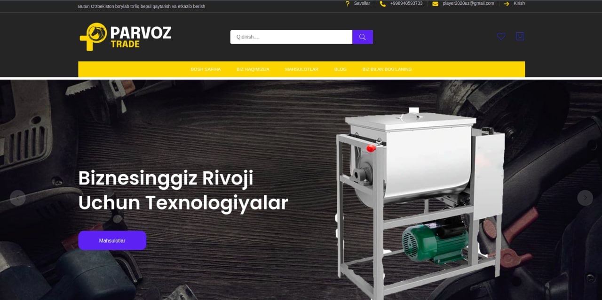
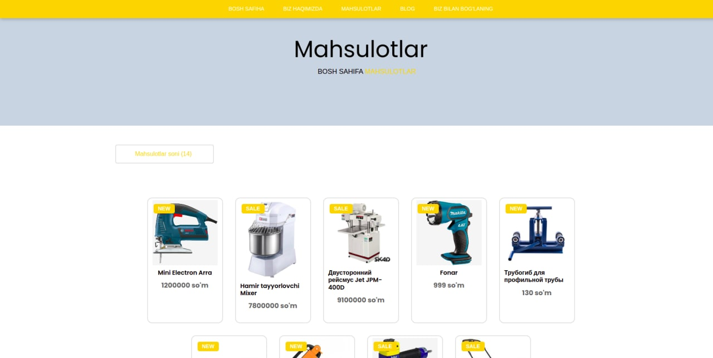
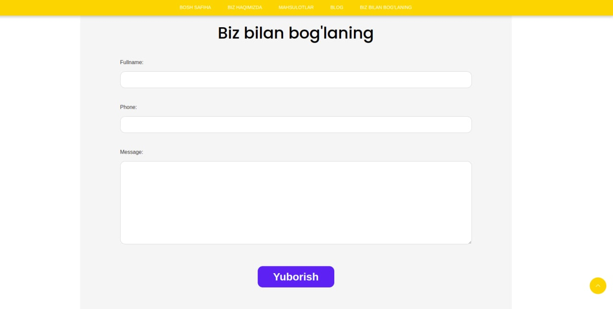

# ParvozTrade
Open Source Online Shop Platform with Python/Django

See the full site here: https://parvoz-trade.uz

# Installation
* 1 - clone repo https://github.com/magic-encode/ParvozTrade.git
* 2 - create a virtual environment and activate
*  - pip install virtualenv
*  - virtualenv envname
*  - envname\scripts\activate
* 3 - cd into project "cd ParvozTrade"
* 4 - pip install -r requirements.txt
* 5 - python manage.py runserver

# Features
* Share Projects
* Facilitate the work of new programmers

# Tech Stack
* Django
* Python
* Postgres

# Home Page

# Products Page

# User Inbox
  